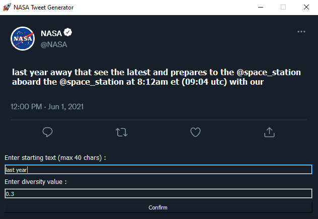

    <h1>Tweet Generator For NASA 🚀</h1>
    
    
    
    

#

    

# Technologies used

- [Tensorflow](https://www.tensorflow.org/)
- [PyQt5](https://pypi.org/project/PyQt5/)
- [Numpy](https://numpy.org/)
- [Pandas](https://pandas.pydata.org/)
- [Tweepy](https://www.tweepy.org/)
- [Dotenv](https://pypi.org/project/python-dotenv/)

# Credits / References

[Rowel Atienze](https://towardsdatascience.com/lstm-by-example-using-tensorflow-feb0c1968537)\
[Talevy23](https://www.kaggle.com/code/talevy23/trump-tweet-generator-lstm-for-text-generation/notebook)

# License

This project is licensed under GPL-3.0 - see the [LICENSE](./LICENSE) file for further details

# Support

Give a ⭐️ if this project was of any help!